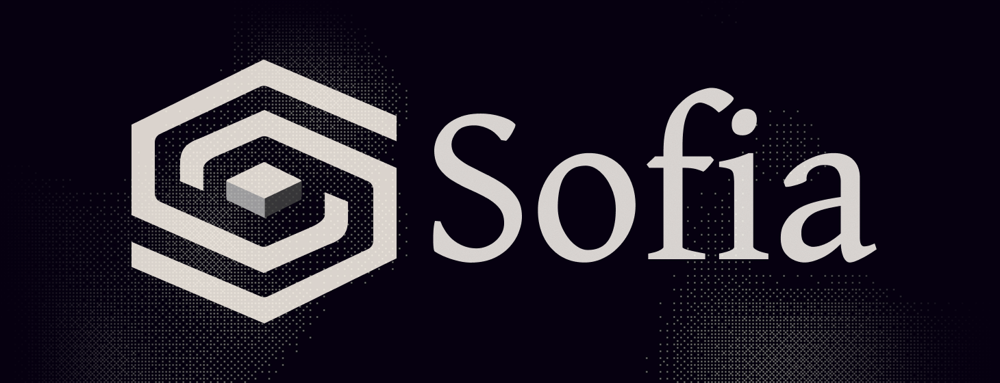

**Transform your browsing into certified knowledge on the blockchain.**


---

Sofia is a full-stack knowledge graph product on the [Intuition](https://intuition.systems) protocol. A Chrome extension captures your browsing, an explorer surfaces your on-chain reputation, AI workflows classify intent, and an MCP server exposes the data to LLMs.

This repository is a **bun workspaces monorepo** containing all surfaces: extension, dashboard, image service, landing page, AI backend, and MCP server.

## Repository layout

```
core/
├── apps/
│   ├── explorer/         React + Vite dashboard — on-chain reputation & discovery
│   ├── extension/        Plasmo Chrome extension (MV3) — browsing certification
│   ├── og/               Next.js OG image generator for shared certifications
│   └── landing/          Docusaurus landing site & docs
├── packages/
│   └── graphql/          @0xsofia/graphql — shared GraphQL client + codegen
└── services/
    ├── mastra/           AI workflows (Mastra + GaiaNet LLM)
    └── mcp-server/       MCP server exposing Intuition knowledge graph to LLMs
```

## Stack per surface

| Surface | Framework | Key libs |
|---|---|---|
| `apps/extension` | [Plasmo](https://docs.plasmo.com/) (Manifest V3) | Privy, Viem, Wagmi, React Query, Tailwind |
| `apps/explorer` | [Vite](https://vitejs.dev/) + React 18 | Privy, Viem, React Router, Radix UI |
| `apps/og` | [Next.js](https://nextjs.org/) 14 | `@vercel/og`, `@vercel/kv` |
| `apps/landing` | [Docusaurus](https://docusaurus.io/) 3 | Privy, Three.js, GSAP |
| `packages/graphql` | tsup + `graphql-codegen` | `graphql-request`, `graphql-ws`, React Query |
| `services/mastra` | [Mastra](https://mastra.ai/) | GaiaNet, `@mastra/core`, Viem |
| `services/mcp-server` | Model Context Protocol SDK | `express`, graphql-codegen |

## Requirements

- **Node.js** `>= 22.13.0`
- **Bun** `>= 1.3.0` — `curl -fsSL https://bun.sh/install | bash`
- **git**, and a wallet (MetaMask / Rabby) to test the extension

## Setup

```bash
git clone git@github.com:intuition-box/Sofia.git
cd Sofia
bun install
```

`bun install` resolves all workspace deps and wires symlinks across `apps/*`, `packages/*`, and `services/*`.

Copy the per-app `.env` files (they are **gitignored**):

| Target | Variables |
|---|---|
| `apps/explorer/.env` | `VITE_PRIVY_APP_ID`, `VITE_PRIVY_CLIENT_ID`, `VITE_OG_BASE_URL`, `VITE_MCP_TRUST_URL` |
| `apps/extension/.env.development` / `.env.production` | `PLASMO_PUBLIC_*` vars (network, server URL, Privy, etc.) |
| `apps/og/.env.local` | `@vercel/kv` connection string |
| `services/mastra/.env` | `GAIANET_*`, `DATABASE_URL`, `MCP_SERVER_URL` |

Build the GraphQL package once (codegen regenerates `src/generated/index.ts`):

```bash
bun run --filter @0xsofia/graphql codegen
```

## Dev commands

| Command | What it runs |
|---|---|
| `bun run --filter explorer dev` | Vite on `localhost:5173` |
| `bun run --filter extension dev` | Plasmo dev, output to `apps/extension/build/chrome-mv3-dev/` |
| `bun run --filter og dev` | Next.js on `localhost:3000` |
| `bun run --filter landing start` | Docusaurus on `localhost:3000` |
| `bun run --filter @0xsofia/graphql codegen` | Regenerate GraphQL types |

**Loading the extension in Chrome**: after `bun run --filter extension dev`, open `chrome://extensions/` → enable Developer mode → "Load unpacked" → pick `apps/extension/build/chrome-mv3-dev/`.

## Architecture

The extension is the primary Sofia surface. It reads the browser history, proposes intentions (learning, work, fun, buying, inspiration, music, trust, distrust), pins URLs to IPFS, then creates atoms and triples on Intuition via the Sofia fee proxy (fixed fee + 5%).

The explorer consumes the same GraphQL indexer to surface a user's reputation, streaks, trust circle, and discovery ranking. WebSocket subscriptions on the shared `@0xsofia/graphql` package keep UI data live across both apps.

Mastra runs AI workflows (theme extraction, recommendations, predicate classification, social verification, skills analysis) via GaiaNet LLM. The MCP server exposes the Intuition graph as tools LLMs can call.

Detailed docs per surface:
- [Extension architecture](apps/extension/ARCHITECTURE.md)
- [Explorer realtime](apps/explorer/docs/plan-realtime-architecture.md)

## Intuition protocol — key concepts

| Concept | Description |
|---|---|
| **Atom** | Basic on-chain entity (URL, account, concept). Created via IPFS pin + MultiVault. |
| **Triple** | `Subject / Predicate / Object` relationship between atoms. |
| **Vault** | Staking vault on each atom/triple, TRUST token bonding curve. |
| **term_id** | Unique atom identifier (bytes32 hash). |
| **Sofia Fee Proxy** | Smart contract wrapping MultiVault with fixed + 5% fees. |

## Contributing

- Branches off `dev`. PRs target `dev`, then `dev` → `main` for releases.
- TypeScript is non-strict (matches existing style).
- Prettier is configured per package.
- Barrel imports: always `import { X } from "~/lib/services"`, never from individual files (extension specifically — see [extension CLAUDE.md](apps/extension/.claude/CLAUDE.md)).

## License

See [LICENSE](LICENSE).
