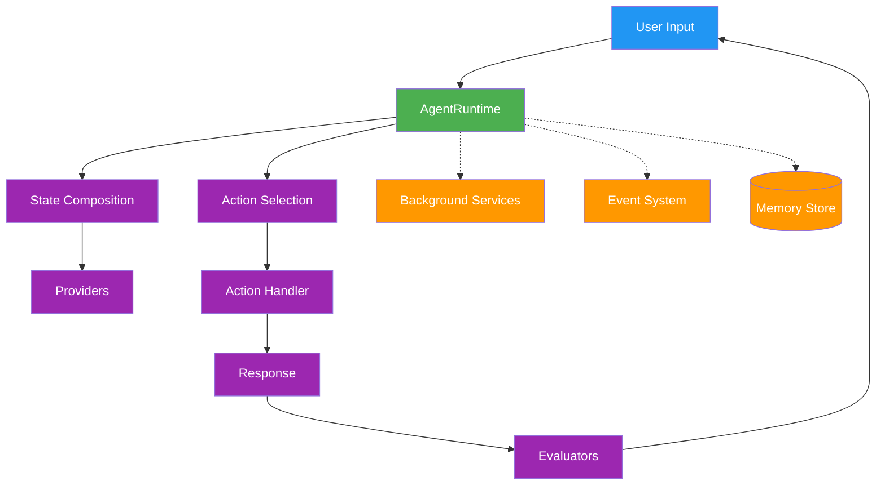
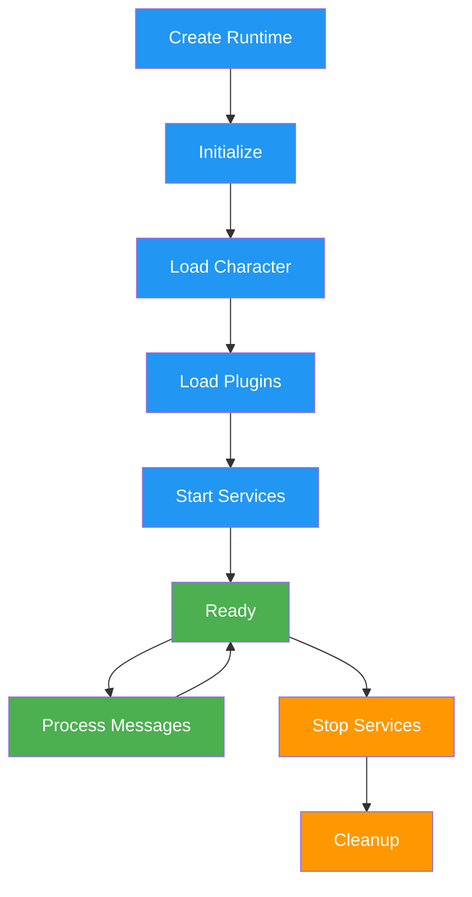
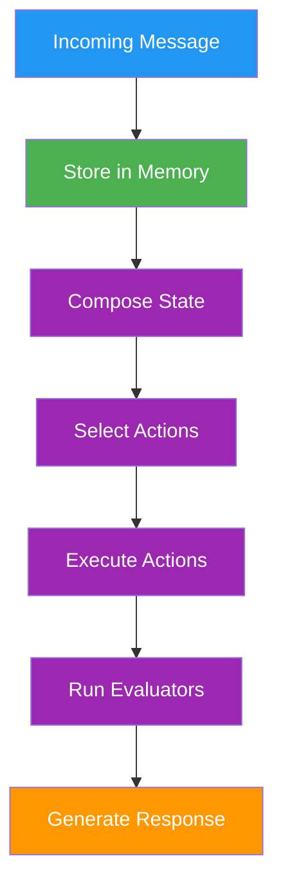
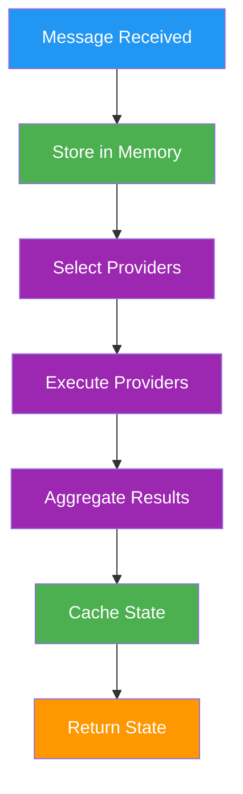
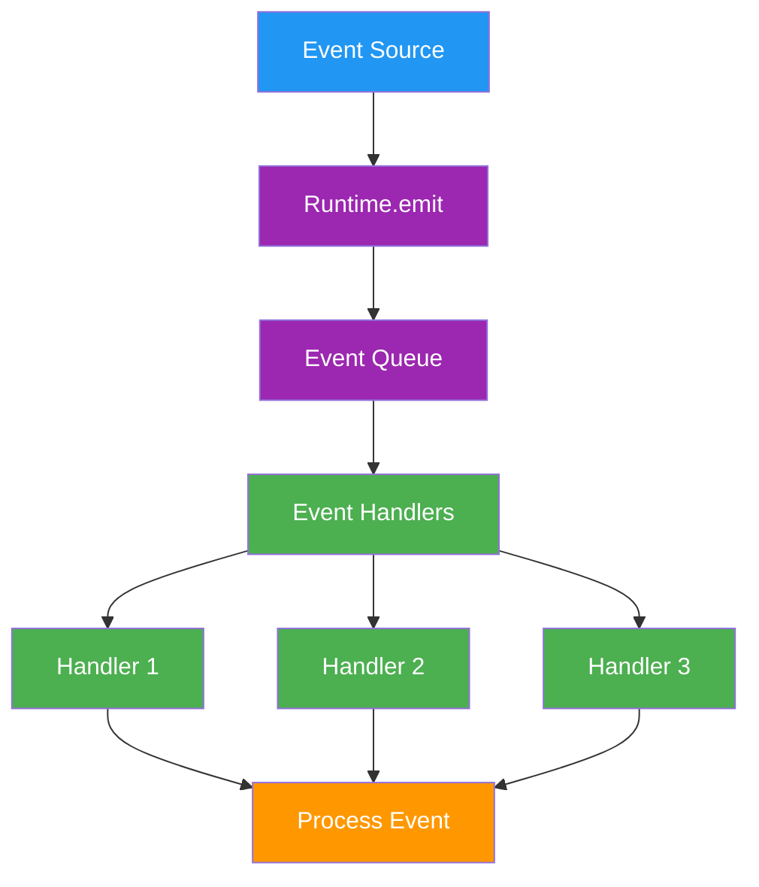
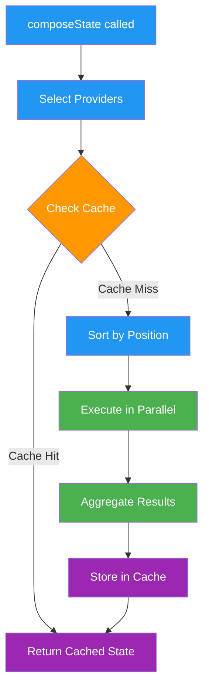

# Core

> Core runtime system, lifecycle, and architecture

## System Architecture

The elizaOS runtime follows a modular, plugin-based architecture that orchestrates all agent functionality. For lifecycle details, see [Runtime and Lifecycle](/agents/runtime-and-lifecycle). For extension architecture, see [Plugin Architecture](/plugins/architecture).



### Core Components

The runtime orchestrates these essential components:

* **AgentRuntime**: Central orchestrator managing agent lifecycle
* **Plugin System**: Extends functionality through modular components
* **Memory System**: Hierarchical storage for conversations and knowledge
* **State Management**: Aggregates context from multiple sources
* **Service Layer**: Background processes and integrations

For related documentation, see [Plugin Architecture](/plugins/architecture), [Memory](/runtime/memory), and [Services](/runtime/services).

## AgentRuntime Class

The `AgentRuntime` class is the central engine that manages agent lifecycle, processes messages, and coordinates all system components.

### Core Interface

```typescript  theme={null}
interface IAgentRuntime extends IDatabaseAdapter {
  // Core properties
  agentId: UUID;
  character: Character;
  providers: Provider[];
  actions: Action[];
  evaluators: Evaluator[];
  services: Service[];
  
  // Action processing
  processActions(message: Memory, responses: Memory[], state?: State): Promise<void>;
  composeState(message: Memory, state?: State): Promise<State>;
  evaluate(message: Memory, state?: State): Promise<void>;
  
  // Component registration
  registerAction(action: Action): void;
  registerProvider(provider: Provider): void;
  registerEvaluator(evaluator: Evaluator): void;
  registerService(service: Service): void;
  
  // Service management
  getService<T>(name: ServiceType): T;
  stop(): Promise<void>;
  
  // Model management
  useModel<T extends ModelTypeName>(modelType: T, params: ModelParamsMap[T], provider?: string): Promise<ModelResultMap[T]>;
  registerModel(modelType: ModelTypeName, handler: ModelHandler, provider?: string, priority?: number): void;
  getModel(modelType: ModelTypeName, provider?: string): ModelHandler | undefined;
  
  // Event system
  emit(eventType: EventType, data: any): Promise<void>;
  on(eventType: EventType, handler: EventHandler): void;
}
```

### Key Responsibilities

#### 1. Action Processing

The runtime orchestrates action selection and execution:

```typescript  theme={null}
async processActions(message: Memory, responses: Memory[], state?: State): Promise<void> {
  // Select and execute actions based on context
  const actions = await this.selectActions(message, state);
  
  for (const action of actions) {
    await action.handler(this, message, state);
  }
  
  // Run evaluators on results
  await this.evaluate(message, state);
}
```

#### 2. State Composition

Builds comprehensive context by aggregating data from providers:

```typescript  theme={null}
async composeState(message: Memory): Promise<State> {
  const state = {};
  
  for (const provider of this.providers) {
    const data = await provider.get(this, message, state);
    Object.assign(state, data);
  }
  
  return state;
}
```

#### 3. Plugin Management

Registers and initializes plugin components:

```typescript  theme={null}
async registerPlugin(plugin: Plugin) {
  // Register components
  plugin.actions?.forEach(a => this.registerAction(a));
  plugin.providers?.forEach(p => this.registerProvider(p));
  plugin.evaluators?.forEach(e => this.registerEvaluator(e));
  plugin.services?.forEach(s => this.registerService(s));
  
  // Initialize plugin
  await plugin.init?.(this.config, this);
}
```

## Runtime Lifecycle



### Initialization Sequence

1. **Runtime Creation**: Instantiate with character and configuration
2. **Character Loading**: Load agent personality and settings
3. **Plugin Loading**: Register plugins in dependency order
4. **Service Startup**: Initialize background services
5. **Ready State**: Agent ready to process messages

### Plugin Loading Order

```typescript  theme={null}
// Plugin priority determines load order
const pluginLoadOrder = [
  databases,      // Priority: -100
  modelProviders, // Priority: -50
  corePlugins,    // Priority: 0
  features,       // Priority: 50
  platforms       // Priority: 100
];
```

## Configuration

### Runtime Configuration

The runtime accepts configuration through multiple sources:

```typescript  theme={null}
interface RuntimeConfig {
  character: Character;
  plugins: Plugin[];
  database?: DatabaseConfig;
  models?: ModelConfig;
  services?: ServiceConfig;
  environment?: EnvironmentConfig;
}
```

### Environment Variables

Core runtime environment variables:

* `NODE_ENV` - Runtime environment (development/production)
* `LOG_LEVEL` - Logging verbosity
* `DATABASE_URL` - Database connection string
* `API_PORT` - Server port for API endpoints
* `AGENT_ID` - Unique agent identifier

### Settings Management

Access configuration through the runtime:

```typescript  theme={null}
// Get setting with fallback
const apiKey = runtime.getSetting("API_KEY");

// Check if setting exists
if (runtime.hasSetting("FEATURE_FLAG")) {
  // Feature is enabled
}
```

## Database Abstraction

The runtime implements `IDatabaseAdapter` for data persistence:

```typescript  theme={null}
interface IDatabaseAdapter {
  // Memory operations
  createMemory(memory: Memory): Promise<void>;
  searchMemories(query: string, limit?: number): Promise<Memory[]>;
  getMemoryById(id: UUID): Promise<Memory | null>;
  
  // Entity management
  createEntity(entity: Entity): Promise<void>;
  updateEntity(entity: Entity): Promise<void>;
  getEntity(id: UUID): Promise<Entity | null>;
  
  // Relationships
  createRelationship(rel: Relationship): Promise<void>;
  getRelationships(entityId: UUID): Promise<Relationship[]>;
  
  // Facts and knowledge
  createFact(fact: Fact): Promise<void>;
  searchFacts(query: string): Promise<Fact[]>;
}
```

### Memory Operations

```typescript  theme={null}
// Store a message
await runtime.createMemory({
  type: MemoryType.MESSAGE,
  content: { text: "User message" },
  roomId: message.roomId,
  userId: message.userId
});

// Search memories
const memories = await runtime.searchMemories(
  "previous conversation",
  10 // limit
);

// Get specific memory
const memory = await runtime.getMemoryById(memoryId);
```

## Message Processing Pipeline

The runtime processes messages through a defined pipeline:



### Processing Steps

1. **Message Receipt**: Receive and validate incoming message
2. **Memory Storage**: Persist message to database
3. **State Composition**: Build context from providers
4. **Action Selection**: Choose appropriate actions
5. **Action Execution**: Run selected action handlers
6. **Evaluation**: Post-process results
7. **Response Generation**: Create and send response

## Error Handling

The runtime implements comprehensive error handling:

```typescript  theme={null}
try {
  await runtime.processActions(message, responses, state);
} catch (error) {
  if (error instanceof ActionError) {
    // Handle action-specific errors
    runtime.logger.error("Action failed:", error);
  } else if (error instanceof StateError) {
    // Handle state composition errors
    runtime.logger.error("State error:", error);
  } else {
    // Handle unexpected errors
    runtime.logger.error("Unexpected error:", error);
    // Optionally trigger recovery
  }
}
```

## Performance Considerations

### State Caching

The runtime caches composed state for performance:

```typescript  theme={null}
// State is cached by message ID
const state = await runtime.composeState(message);
// Subsequent calls use cache
const cachedState = await runtime.composeState(message);
```

### Service Pooling

Services are singleton instances shared across the runtime:

```typescript  theme={null}
// Services are created once and reused
const service = runtime.getService(ServiceType.DATABASE);
// Same instance returned
const sameService = runtime.getService(ServiceType.DATABASE);
```

## Best Practices

### Runtime Initialization

* Initialize plugins in dependency order
* Start services after all plugins are loaded
* Verify character configuration before starting
* Set up error handlers before processing

### Resource Management

* Clean up services on shutdown
* Clear state cache periodically
* Monitor memory usage
* Implement connection pooling

### Error Recovery

* Implement retry logic for transient failures
* Log errors with context
* Gracefully degrade functionality
* Maintain audit trail

## Integration Points

The runtime provides multiple integration points:

* **Plugins**: Extend functionality through the plugin system
* **Events**: React to runtime events
* **Services**: Add background processes
* **Models**: Integrate AI providers
* **Database**: Custom database adapters
* **API**: HTTP endpoints through routes

## See Also

<CardGroup cols={2}>
  <Card title="Memory System" icon="brain" href="/runtime/memory">
    Learn about the fundamental storage layer
  </Card>

  <Card title="Events" icon="bolt" href="/runtime/events">
    Understand the communication backbone
  </Card>

  <Card title="Providers" icon="database" href="/runtime/providers">
    Explore how to supply data to the runtime
  </Card>

  <Card title="Models" icon="robot" href="/runtime/models">
    Discover AI model management
  </Card>
</CardGroup>
Search...


# Memory & State

> Memory system, state management, and data persistence

## Memory System

The memory system provides hierarchical storage for conversations, knowledge, and agent state. It enables agents to maintain context, learn from interactions, and build persistent knowledge. For conceptual overview, see [Memory and State](/agents/memory-and-state). For runtime architecture, see [Runtime Core](/runtime/core).

## Memory Types

### Core Memory Types

```typescript  theme={null}
enum MemoryType {
  MESSAGE = 'message',           // Conversation messages
  FACT = 'fact',                // Extracted knowledge
  DOCUMENT = 'document',         // Document storage
  RELATIONSHIP = 'relationship', // Entity relationships
  GOAL = 'goal',                // Agent goals
  TASK = 'task',                // Scheduled tasks
  ACTION = 'action',            // Action execution records
}
```

### Memory Interface

```typescript  theme={null}
interface Memory {
  id: UUID;
  type: MemoryType;
  roomId: UUID;
  userId?: UUID;
  agentId?: UUID;
  content: {
    text: string;
    [key: string]: any;
  };
  embedding?: number[];
  createdAt: Date;
  updatedAt?: Date;
  metadata?: Record<string, any>;
}
```

## State Management

### State Structure

State represents the agent's current understanding of context:

```typescript  theme={null}
interface State {
  // Key-value pairs for template access
  values: Record<string, any>;
  
  // Structured data from providers
  data: Record<string, any>;
  
  // Concatenated textual context
  text: string;
}
```

### State Composition Pipeline



## Memory Operations

### Creating Memories

```typescript  theme={null}
// Store a message
await runtime.createMemory({
  type: MemoryType.MESSAGE,
  content: { 
    text: "User message",
    role: 'user',
    name: 'John'
  },
  roomId: message.roomId,
  userId: message.userId,
  metadata: {
    platform: 'discord',
    channelId: '12345'
  }
});

// Store a fact
await runtime.createMemory({
  type: MemoryType.FACT,
  content: {
    text: "The user's favorite color is blue",
    subject: 'user',
    predicate: 'favorite_color',
    object: 'blue'
  },
  roomId: message.roomId
});

// Store an action result
await runtime.createMemory({
  type: MemoryType.ACTION,
  content: {
    text: "Generated image of a sunset",
    action: 'IMAGE_GENERATION',
    result: { url: 'https://...' }
  },
  roomId: message.roomId,
  agentId: runtime.agentId
});
```

### Searching Memories

```typescript  theme={null}
// Text search with embeddings
const memories = await runtime.searchMemories(
  "previous conversation about colors",
  10 // limit
);

// Search with filters
const facts = await runtime.searchMemories({
  query: "user preferences",
  type: MemoryType.FACT,
  roomId: currentRoom.id,
  limit: 5
});

// Search by time range
const recentMessages = await runtime.searchMemories({
  type: MemoryType.MESSAGE,
  roomId: currentRoom.id,
  after: new Date(Date.now() - 3600000), // Last hour
  limit: 20
});
```

### Memory Retrieval

```typescript  theme={null}
// Get specific memory
const memory = await runtime.getMemoryById(memoryId);

// Get memories by room
const roomMemories = await runtime.getMemoriesByRoom(
  roomId,
  { type: MemoryType.MESSAGE, limit: 50 }
);

// Get user memories
const userMemories = await runtime.getMemoriesByUser(
  userId,
  { type: MemoryType.FACT }
);
```

## Embeddings and Similarity

### Creating Embeddings

```typescript  theme={null}
// Generate embedding for text
const embedding = await runtime.useModel(
  ModelType.TEXT_EMBEDDING,
  { input: "Text to embed" }
);

// Store with embedding
await runtime.createMemory({
  type: MemoryType.MESSAGE,
  content: { text: "Important message" },
  embedding: embedding,
  roomId: message.roomId
});
```

### Similarity Search

```typescript  theme={null}
// Search by semantic similarity
const similarMemories = await runtime.searchMemoriesBySimilarity(
  embedding,
  {
    threshold: 0.8,  // Similarity threshold (0-1)
    limit: 10,
    type: MemoryType.MESSAGE
  }
);

// Find related facts
const queryEmbedding = await runtime.useModel(
  ModelType.TEXT_EMBEDDING,
  { input: "What does the user like?" }
);

const relatedFacts = await runtime.searchMemoriesBySimilarity(
  queryEmbedding,
  {
    type: MemoryType.FACT,
    threshold: 0.7,
    limit: 5
  }
);
```

## Facts and Knowledge

### Fact Extraction

Facts are automatically extracted from conversations:

```typescript  theme={null}
interface Fact extends Memory {
  type: MemoryType.FACT;
  content: {
    text: string;
    subject?: string;    // Entity the fact is about
    predicate?: string;  // Relationship or property
    object?: string;     // Value or related entity
    confidence?: number; // Extraction confidence
    source?: string;     // Source message ID
  };
}
```

### Fact Management

```typescript  theme={null}
// Create a fact
await runtime.createFact({
  subject: 'user',
  predicate: 'works_at',
  object: 'TechCorp',
  confidence: 0.95,
  source: message.id
});

// Query facts
const userFacts = await runtime.getFacts({
  subject: 'user',
  limit: 10
});

// Update fact confidence
await runtime.updateFact(factId, {
  confidence: 0.98
});
```

## Relationships

### Relationship Storage

```typescript  theme={null}
interface Relationship extends Memory {
  type: MemoryType.RELATIONSHIP;
  userId: UUID;
  targetEntityId: UUID;
  relationshipType: string;
  strength: number;
  metadata?: {
    firstInteraction?: Date;
    lastInteraction?: Date;
    interactionCount?: number;
    sentiment?: number;
  };
}
```

### Managing Relationships

```typescript  theme={null}
// Create relationship
await runtime.createRelationship({
  userId: user.id,
  targetEntityId: otherUser.id,
  relationshipType: 'friend',
  strength: 0.8
});

// Get user relationships
const relationships = await runtime.getRelationships(userId);

// Update relationship strength
await runtime.updateRelationship(relationshipId, {
  strength: 0.9,
  metadata: {
    lastInteraction: new Date(),
    interactionCount: prevCount + 1
  }
});
```

## State Cache

### Cache Architecture

The runtime maintains an in-memory cache for composed states:

```typescript  theme={null}
class StateCache {
  private cache: Map<UUID, State>;
  private timestamps: Map<UUID, number>;
  private maxSize: number;
  private ttl: number;
  
  constructor(maxSize = 1000, ttl = 300000) { // 5 min TTL
    this.cache = new Map();
    this.timestamps = new Map();
    this.maxSize = maxSize;
    this.ttl = ttl;
  }
  
  set(messageId: UUID, state: State): void {
    // Evict oldest if at capacity
    if (this.cache.size >= this.maxSize) {
      const oldest = this.getOldestEntry();
      if (oldest) {
        this.cache.delete(oldest);
        this.timestamps.delete(oldest);
      }
    }
    
    this.cache.set(messageId, state);
    this.timestamps.set(messageId, Date.now());
  }
  
  get(messageId: UUID): State | undefined {
    const timestamp = this.timestamps.get(messageId);
    
    // Check if expired
    if (timestamp && Date.now() - timestamp > this.ttl) {
      this.cache.delete(messageId);
      this.timestamps.delete(messageId);
      return undefined;
    }
    
    return this.cache.get(messageId);
  }
}
```

### Cache Management

```typescript  theme={null}
// Clear old cache entries
function cleanupCache(runtime: IAgentRuntime) {
  const now = Date.now();
  const maxAge = 5 * 60 * 1000; // 5 minutes
  
  for (const [messageId, timestamp] of runtime.stateCache.timestamps) {
    if (now - timestamp > maxAge) {
      runtime.stateCache.delete(messageId);
    }
  }
}

// Schedule periodic cleanup
setInterval(() => cleanupCache(runtime), 60000);
```

## Document Storage

### Document Memory

```typescript  theme={null}
interface DocumentMemory extends Memory {
  type: MemoryType.DOCUMENT;
  content: {
    text: string;
    title?: string;
    source?: string;
    chunks?: string[];
    summary?: string;
  };
  embedding?: number[];
  metadata?: {
    mimeType?: string;
    size?: number;
    hash?: string;
    tags?: string[];
  };
}
```

### Document Operations

```typescript  theme={null}
// Store document
await runtime.createDocument({
  title: 'User Manual',
  content: documentText,
  source: 'https://example.com/manual.pdf',
  chunks: splitIntoChunks(documentText),
  metadata: {
    mimeType: 'application/pdf',
    size: 1024000,
    tags: ['manual', 'reference']
  }
});

// Search documents
const relevantDocs = await runtime.searchDocuments(
  "how to configure settings",
  { limit: 5 }
);

// Get document chunks
const chunks = await runtime.getDocumentChunks(
  documentId,
  { relevant_to: "specific query" }
);
```

## Memory Cleanup

### Automatic Cleanup

```typescript  theme={null}
class MemoryCleanupService {
  private readonly MAX_MESSAGE_AGE = 30 * 24 * 60 * 60 * 1000; // 30 days
  private readonly MAX_FACTS_PER_ROOM = 1000;
  
  async cleanup(runtime: IAgentRuntime) {
    // Remove old messages
    await this.cleanupOldMessages(runtime);
    
    // Consolidate facts
    await this.consolidateFacts(runtime);
    
    // Remove orphaned relationships
    await this.cleanupOrphanedRelationships(runtime);
  }
  
  private async cleanupOldMessages(runtime: IAgentRuntime) {
    const cutoffDate = new Date(Date.now() - this.MAX_MESSAGE_AGE);
    
    await runtime.deleteMemories({
      type: MemoryType.MESSAGE,
      before: cutoffDate
    });
  }
  
  private async consolidateFacts(runtime: IAgentRuntime) {
    const rooms = await runtime.getAllRooms();
    
    for (const room of rooms) {
      const facts = await runtime.getFacts({ roomId: room.id });
      
      if (facts.length > this.MAX_FACTS_PER_ROOM) {
        // Keep only high-confidence recent facts
        const toKeep = facts
          .sort((a, b) => {
            const scoreA = a.confidence * (1 / (Date.now() - a.createdAt));
            const scoreB = b.confidence * (1 / (Date.now() - b.createdAt));
            return scoreB - scoreA;
          })
          .slice(0, this.MAX_FACTS_PER_ROOM);
        
        const toDelete = facts.filter(f => !toKeep.includes(f));
        for (const fact of toDelete) {
          await runtime.deleteMemory(fact.id);
        }
      }
    }
  }
}
```

### Manual Cleanup

```typescript  theme={null}
// Delete specific memories
await runtime.deleteMemory(memoryId);

// Bulk delete
await runtime.deleteMemories({
  type: MemoryType.MESSAGE,
  roomId: roomId,
  before: cutoffDate
});

// Clear room memories
await runtime.clearRoomMemories(roomId);
```

## Memory Optimization

### Indexing Strategies

```typescript  theme={null}
// Database indexes for performance
CREATE INDEX idx_memories_room_type ON memories(roomId, type);
CREATE INDEX idx_memories_user_created ON memories(userId, createdAt);
CREATE INDEX idx_memories_embedding ON memories USING ivfflat (embedding);
CREATE INDEX idx_facts_subject_predicate ON facts(subject, predicate);
```

### Batch Operations

```typescript  theme={null}
// Batch insert memories
await runtime.createMemoriesBatch([
  { type: MemoryType.MESSAGE, content: { text: "Message 1" }, roomId },
  { type: MemoryType.MESSAGE, content: { text: "Message 2" }, roomId },
  // ... more memories
]);

// Batch embedding generation
const texts = memories.map(m => m.content.text);
const embeddings = await runtime.useModel(
  ModelType.TEXT_EMBEDDING,
  { input: texts, batch: true }
);
```

### Memory Compression

```typescript  theme={null}
// Compress old memories
async function compressMemories(runtime: IAgentRuntime, roomId: UUID) {
  const messages = await runtime.getMemories({
    type: MemoryType.MESSAGE,
    roomId,
    before: new Date(Date.now() - 7 * 24 * 60 * 60 * 1000) // 7 days
  });
  
  // Generate summary
  const summary = await runtime.useModel(
    ModelType.TEXT_LARGE,
    {
      prompt: `Summarize these messages: ${messages.map(m => m.content.text).join('\n')}`,
      maxTokens: 500
    }
  );
  
  // Store summary
  await runtime.createMemory({
    type: MemoryType.DOCUMENT,
    content: {
      text: summary,
      title: 'Conversation Summary',
      source: 'compressed_messages'
    },
    roomId,
    metadata: {
      originalCount: messages.length,
      dateRange: {
        start: messages[0].createdAt,
        end: messages[messages.length - 1].createdAt
      }
    }
  });
  
  // Delete original messages
  for (const message of messages) {
    await runtime.deleteMemory(message.id);
  }
}
```

## Best Practices

### Memory Design

* **Type Selection**: Use appropriate memory types for different data
* **Embedding Strategy**: Generate embeddings for searchable content
* **Metadata Usage**: Store relevant metadata for filtering
* **Relationship Tracking**: Maintain entity relationships
* **Fact Extraction**: Extract and store facts from conversations

### Performance

* **Indexing**: Create appropriate database indexes
* **Batch Operations**: Use batch operations for multiple items
* **Caching**: Cache frequently accessed memories
* **Cleanup**: Implement regular cleanup routines
* **Compression**: Compress old data to save space

### Data Integrity

* **Validation**: Validate memory content before storage
* **Deduplication**: Prevent duplicate facts and relationships
* **Consistency**: Maintain referential integrity
* **Versioning**: Track memory updates and changes
* **Backup**: Regular backup of critical memories

## See Also

<CardGroup cols={2}>
  <Card title="Events" icon="bolt" href="/runtime/events">
    Learn about the communication system
  </Card>

  <Card title="Providers" icon="database" href="/runtime/providers">
    Understand how providers use memory
  </Card>

  <Card title="Models" icon="robot" href="/runtime/models">
    Explore AI model integration
  </Card>

  <Card title="Services" icon="server" href="/runtime/services">
    Build services that manage memory
  </Card>
</CardGroup>
# Events

> Event system, event types, and event handling patterns

## Event System

The event system enables reactive programming patterns, allowing plugins and services to respond to runtime activities. Events flow through the system providing hooks for custom logic and integrations.

## Event Architecture



## Event Types

### Core Event Types

```typescript  theme={null}
enum EventType {
  // World events
  WORLD_JOINED = 'world:joined',
  WORLD_CONNECTED = 'world:connected',
  WORLD_LEFT = 'world:left',
  
  // Entity events
  ENTITY_JOINED = 'entity:joined',
  ENTITY_LEFT = 'entity:left',
  ENTITY_UPDATED = 'entity:updated',
  
  // Room events
  ROOM_JOINED = 'room:joined',
  ROOM_LEFT = 'room:left',
  ROOM_UPDATED = 'room:updated',
  
  // Message events
  MESSAGE_RECEIVED = 'message:received',
  MESSAGE_SENT = 'message:sent',
  MESSAGE_DELETED = 'message:deleted',
  MESSAGE_UPDATED = 'message:updated',
  
  // Voice events
  VOICE_MESSAGE_RECEIVED = 'voice:message:received',
  VOICE_MESSAGE_SENT = 'voice:message:sent',
  VOICE_STARTED = 'voice:started',
  VOICE_ENDED = 'voice:ended',
  
  // Run events
  RUN_STARTED = 'run:started',
  RUN_COMPLETED = 'run:completed',
  RUN_FAILED = 'run:failed',
  RUN_TIMEOUT = 'run:timeout',
  
  // Action events
  ACTION_STARTED = 'action:started',
  ACTION_COMPLETED = 'action:completed',
  ACTION_FAILED = 'action:failed',
  
  // Evaluator events
  EVALUATOR_STARTED = 'evaluator:started',
  EVALUATOR_COMPLETED = 'evaluator:completed',
  EVALUATOR_FAILED = 'evaluator:failed',
  
  // Model events
  MODEL_USED = 'model:used',
  MODEL_FAILED = 'model:failed',
  
  // Service events
  SERVICE_STARTED = 'service:started',
  SERVICE_STOPPED = 'service:stopped',
  SERVICE_ERROR = 'service:error'
}
```

## Event Payloads

### Payload Interfaces

Each event type has a specific payload structure:

```typescript  theme={null}
// Message event payload
interface MessagePayload {
  runtime: IAgentRuntime;
  message: Memory;
  room?: Room;
  user?: User;
  callback?: ResponseCallback;
}

// World event payload
interface WorldPayload {
  runtime: IAgentRuntime;
  world: World;
  metadata?: Record<string, any>;
}

// Entity event payload
interface EntityPayload {
  runtime: IAgentRuntime;
  entity: Entity;
  action: 'joined' | 'left' | 'updated';
  changes?: Partial<Entity>;
}

// Action event payload
interface ActionPayload {
  runtime: IAgentRuntime;
  action: Action;
  message: Memory;
  state: State;
  result?: any;
  error?: Error;
}

// Model event payload
interface ModelPayload {
  runtime: IAgentRuntime;
  modelType: ModelTypeName;
  provider: string;
  params: any;
  result?: any;
  error?: Error;
  duration: number;
}
```

## Event Handlers

### Handler Registration

Event handlers are registered during plugin initialization:

```typescript  theme={null}
const myPlugin: Plugin = {
  name: 'my-plugin',
  events: {
    [EventType.MESSAGE_RECEIVED]: [
      handleMessageReceived,
      logMessage
    ],
    [EventType.ACTION_COMPLETED]: [
      processActionResult
    ],
    [EventType.RUN_COMPLETED]: [
      cleanupRun
    ]
  }
};
```

### Handler Implementation

```typescript  theme={null}
// Message handler
async function handleMessageReceived(payload: MessagePayload) {
  const { runtime, message, room, user, callback } = payload;
  
  // Process the message
  const state = await runtime.composeState(message);
  
  // Check if we should respond
  if (shouldRespond(message, state)) {
    await runtime.processActions(message, [], state);
  }
  
  // Call callback if provided
  if (callback) {
    await callback({
      text: 'Message processed',
      metadata: { processed: true }
    });
  }
}

// Action handler
async function processActionResult(payload: ActionPayload) {
  const { runtime, action, result, error } = payload;
  
  if (error) {
    runtime.logger.error(`Action ${action.name} failed:`, error);
    // Handle error
    return;
  }
  
  // Process successful result
  runtime.logger.info(`Action ${action.name} completed:`, result);
  
  // Store result in memory
  await runtime.createMemory({
    type: MemoryType.ACTION,
    content: {
      text: `Action ${action.name} completed`,
      action: action.name,
      result
    },
    roomId: payload.message.roomId
  });
}
```

## Event Emission

### Emitting Events

```typescript  theme={null}
// Emit an event from the runtime
await runtime.emit(EventType.MESSAGE_RECEIVED, {
  runtime,
  message,
  room,
  user,
  callback
});

// Emit from a service
class CustomService extends Service {
  async processData(data: any) {
    await this.runtime.emit(EventType.CUSTOM_EVENT, {
      runtime: this.runtime,
      data,
      timestamp: Date.now()
    });
  }
}

// Emit from an action
const customAction: Action = {
  name: 'CUSTOM_ACTION',
  handler: async (runtime, message, state) => {
    // Do work
    const result = await performAction();
    
    // Emit completion event
    await runtime.emit(EventType.ACTION_COMPLETED, {
      runtime,
      action: customAction,
      message,
      state,
      result
    });
    
    return result;
  }
};
```

## Event Listeners

### Adding Event Listeners

```typescript  theme={null}
// Add listener to runtime
runtime.on(EventType.MESSAGE_RECEIVED, async (payload) => {
  console.log('Message received:', payload.message.content.text);
});

// Add multiple listeners
runtime.on(EventType.ACTION_STARTED, logActionStart);
runtime.on(EventType.ACTION_STARTED, trackActionMetrics);
runtime.on(EventType.ACTION_STARTED, notifyActionStart);

// One-time listener
runtime.once(EventType.SERVICE_STARTED, async (payload) => {
  console.log('Service started:', payload.service.name);
});
```

### Removing Event Listeners

```typescript  theme={null}
// Remove specific listener
runtime.off(EventType.MESSAGE_RECEIVED, messageHandler);

// Remove all listeners for an event
runtime.removeAllListeners(EventType.MESSAGE_RECEIVED);

// Remove all listeners
runtime.removeAllListeners();
```

## Event Patterns

### Request-Response Pattern

```typescript  theme={null}
// Emit event and wait for response
async function requestWithResponse(runtime: IAgentRuntime, data: any) {
  return new Promise((resolve, reject) => {
    const timeout = setTimeout(() => {
      reject(new Error('Response timeout'));
    }, 5000);
    
    // Listen for response
    runtime.once(EventType.RESPONSE_RECEIVED, (payload) => {
      clearTimeout(timeout);
      resolve(payload.response);
    });
    
    // Emit request
    runtime.emit(EventType.REQUEST_SENT, {
      runtime,
      data,
      requestId: generateId()
    });
  });
}
```

### Event Chaining

```typescript  theme={null}
// Chain events for complex workflows
const workflowPlugin: Plugin = {
  name: 'workflow',
  events: {
    [EventType.MESSAGE_RECEIVED]: [
      async (payload) => {
        // Step 1: Process message
        const processed = await processMessage(payload);
        
        // Emit next event
        await payload.runtime.emit(EventType.MESSAGE_PROCESSED, {
          ...payload,
          processed
        });
      }
    ],
    
    [EventType.MESSAGE_PROCESSED]: [
      async (payload) => {
        // Step 2: Generate response
        const response = await generateResponse(payload);
        
        // Emit next event
        await payload.runtime.emit(EventType.RESPONSE_GENERATED, {
          ...payload,
          response
        });
      }
    ],
    
    [EventType.RESPONSE_GENERATED]: [
      async (payload) => {
        // Step 3: Send response
        await sendResponse(payload);
      }
    ]
  }
};
```

### Event Aggregation

```typescript  theme={null}
// Aggregate multiple events
class EventAggregator {
  private events: Map<string, any[]> = new Map();
  private flushInterval: NodeJS.Timer;
  
  constructor(private runtime: IAgentRuntime) {
    // Listen for events to aggregate
    runtime.on(EventType.MODEL_USED, this.aggregate.bind(this));
    
    // Flush periodically
    this.flushInterval = setInterval(() => this.flush(), 60000);
  }
  
  private aggregate(payload: ModelPayload) {
    const key = `${payload.modelType}:${payload.provider}`;
    
    if (!this.events.has(key)) {
      this.events.set(key, []);
    }
    
    this.events.get(key).push({
      timestamp: Date.now(),
      duration: payload.duration,
      params: payload.params
    });
  }
  
  private async flush() {
    for (const [key, events] of this.events.entries()) {
      const [modelType, provider] = key.split(':');
      
      // Calculate metrics
      const metrics = {
        count: events.length,
        avgDuration: events.reduce((sum, e) => sum + e.duration, 0) / events.length,
        totalDuration: events.reduce((sum, e) => sum + e.duration, 0)
      };
      
      // Emit aggregated event
      await this.runtime.emit(EventType.METRICS_AGGREGATED, {
        runtime: this.runtime,
        modelType,
        provider,
        metrics,
        period: 60000
      });
    }
    
    // Clear events
    this.events.clear();
  }
  
  stop() {
    clearInterval(this.flushInterval);
  }
}
```

## Custom Events

### Defining Custom Events

```typescript  theme={null}
// Extend EventType with custom events
declare module '@elizaos/core' {
  interface EventTypeRegistry {
    CUSTOM_DATA_RECEIVED: 'custom:data:received';
    CUSTOM_PROCESS_COMPLETE: 'custom:process:complete';
    CUSTOM_ERROR_OCCURRED: 'custom:error:occurred';
  }
}

// Define custom payload
interface CustomDataPayload {
  runtime: IAgentRuntime;
  data: any;
  source: string;
  timestamp: number;
}
```

### Using Custom Events

```typescript  theme={null}
const customPlugin: Plugin = {
  name: 'custom-plugin',
  
  events: {
    'custom:data:received': [
      async (payload: CustomDataPayload) => {
        // Process custom data
        const processed = await processCustomData(payload.data);
        
        // Emit completion
        await payload.runtime.emit('custom:process:complete', {
          runtime: payload.runtime,
          original: payload.data,
          processed,
          duration: Date.now() - payload.timestamp
        });
      }
    ]
  },
  
  actions: [{
    name: 'RECEIVE_DATA',
    handler: async (runtime, message, state) => {
      // Emit custom event
      await runtime.emit('custom:data:received', {
        runtime,
        data: message.content,
        source: 'user',
        timestamp: Date.now()
      });
    }
  }]
};
```

## Event Middleware

### Creating Event Middleware

```typescript  theme={null}
// Middleware to log all events
function loggingMiddleware(eventType: EventType, payload: any) {
  console.log(`[Event] ${eventType}:`, {
    timestamp: new Date().toISOString(),
    type: eventType,
    payload: JSON.stringify(payload).slice(0, 200)
  });
}

// Middleware to filter events
function filterMiddleware(allowedEvents: EventType[]) {
  return (eventType: EventType, payload: any, next: Function) => {
    if (allowedEvents.includes(eventType)) {
      next(payload);
    }
  };
}

// Middleware to transform payload
function transformMiddleware(eventType: EventType, payload: any, next: Function) {
  const transformed = {
    ...payload,
    timestamp: Date.now(),
    eventType
  };
  next(transformed);
}
```

## Error Handling

### Event Error Handling

```typescript  theme={null}
// Global error handler for events
runtime.on('error', (error: Error, eventType: EventType, payload: any) => {
  console.error(`Error in event ${eventType}:`, error);
  
  // Log to monitoring service
  monitoringService.logError({
    error: error.message,
    stack: error.stack,
    eventType,
    payload: JSON.stringify(payload).slice(0, 1000)
  });
});

// Handler with error handling
async function safeEventHandler(payload: any) {
  try {
    await riskyOperation(payload);
  } catch (error) {
    // Emit error event
    await payload.runtime.emit(EventType.SERVICE_ERROR, {
      runtime: payload.runtime,
      error,
      originalEvent: payload
    });
    
    // Don't throw - allow other handlers to run
  }
}
```

## Performance Considerations

### Event Batching

```typescript  theme={null}
class EventBatcher {
  private batch: Map<EventType, any[]> = new Map();
  private batchSize = 100;
  private flushInterval = 1000;
  private timer: NodeJS.Timer;
  
  constructor(private runtime: IAgentRuntime) {
    this.timer = setInterval(() => this.flush(), this.flushInterval);
  }
  
  add(eventType: EventType, payload: any) {
    if (!this.batch.has(eventType)) {
      this.batch.set(eventType, []);
    }
    
    const events = this.batch.get(eventType);
    events.push(payload);
    
    if (events.length >= this.batchSize) {
      this.flushType(eventType);
    }
  }
  
  private flushType(eventType: EventType) {
    const events = this.batch.get(eventType);
    if (!events || events.length === 0) return;
    
    // Emit batch event
    this.runtime.emit(`${eventType}:batch` as EventType, {
      runtime: this.runtime,
      events,
      count: events.length
    });
    
    this.batch.set(eventType, []);
  }
  
  flush() {
    for (const eventType of this.batch.keys()) {
      this.flushType(eventType);
    }
  }
  
  stop() {
    clearInterval(this.timer);
    this.flush();
  }
}
```

### Event Throttling

```typescript  theme={null}
// Throttle high-frequency events
function throttleEvents(eventType: EventType, delay: number) {
  let lastEmit = 0;
  let pending: any = null;
  let timer: NodeJS.Timeout;
  
  return (payload: any) => {
    const now = Date.now();
    
    if (now - lastEmit >= delay) {
      // Emit immediately
      runtime.emit(eventType, payload);
      lastEmit = now;
    } else {
      // Store for later
      pending = payload;
      
      // Schedule emit
      if (!timer) {
        timer = setTimeout(() => {
          if (pending) {
            runtime.emit(eventType, pending);
            lastEmit = Date.now();
            pending = null;
          }
          timer = null;
        }, delay - (now - lastEmit));
      }
    }
  };
}
```

## Best Practices

### Event Design

* **Specific Events**: Create specific events rather than generic ones
* **Consistent Payloads**: Use consistent payload structures
* **Event Naming**: Use clear, hierarchical naming (domain:action:status)
* **Documentation**: Document event types and payloads
* **Versioning**: Version events when making breaking changes

### Performance

* **Async Handlers**: Always use async handlers
* **Non-Blocking**: Don't block the event loop
* **Batching**: Batch high-frequency events
* **Throttling**: Throttle rapid events
* **Cleanup**: Remove unused listeners

### Error Handling

* **Graceful Failures**: Don't crash on handler errors
* **Error Events**: Emit error events for monitoring
* **Timeouts**: Set timeouts for long operations
* **Retries**: Implement retry logic for transient failures
* **Logging**: Log errors with context

## See Also

<CardGroup cols={2}>
  <Card title="Providers" icon="database" href="/runtime/providers">
    Learn how providers use events
  </Card>

  <Card title="Models" icon="robot" href="/runtime/models">
    Explore AI model management
  </Card>

  <Card title="Services" icon="server" href="/runtime/services">
    Build services that emit and handle events
  </Card>

  <Card title="Messaging" icon="message" href="/runtime/messaging">
    Understand real-time event streaming
  </Card>
</CardGroup>
# Providers

> Provider system for context aggregation and state composition

## Provider Interface

Providers supply contextual information that forms the agent's understanding of the current situation. They are the "senses" of the agent, gathering data from various sources to build comprehensive state.

### Core Interface

```typescript  theme={null}
interface Provider {
  name: string;
  description: string;
  dynamic?: boolean;    // Only executed when explicitly requested
  private?: boolean;    // Internal-only, not included in default state
  position?: number;    // Execution order (lower runs first)
  
  get: (
    runtime: IAgentRuntime,
    message: Memory,
    state?: State
  ) => Promise<ProviderResult>;
}

interface ProviderResult {
  values: Record<string, any>;  // Key-value pairs for templates
  data: Record<string, any>;    // Structured data
  text: string;                 // Textual context
}
```

### Provider Types

* **Standard Providers**: Included by default in state composition
* **Dynamic Providers**: Only executed when explicitly requested
* **Private Providers**: Internal use only, not exposed in default state

## Built-in Providers

### Provider Summary Table

| Provider Name        | Dynamic | Position | Default Included | Purpose                    |
| -------------------- | ------- | -------- | ---------------- | -------------------------- |
| **ACTIONS**          | No      | -1       | Yes              | Lists available actions    |
| **ACTION\_STATE**    | No      | 150      | Yes              | Action execution state     |
| **ANXIETY**          | No      | Default  | Yes              | Response style guidelines  |
| **ATTACHMENTS**      | Yes     | Default  | No               | File/media attachments     |
| **CAPABILITIES**     | No      | Default  | Yes              | Service capabilities       |
| **CHARACTER**        | No      | Default  | Yes              | Agent personality          |
| **CHOICE**           | No      | Default  | Yes              | Pending user choices       |
| **ENTITIES**         | Yes     | Default  | No               | Conversation participants  |
| **EVALUATORS**       | No      | Default  | No (private)     | Post-processing options    |
| **FACTS**            | Yes     | Default  | No               | Stored knowledge           |
| **PROVIDERS**        | No      | Default  | Yes              | Available providers list   |
| **RECENT\_MESSAGES** | No      | 100      | Yes              | Conversation history       |
| **RELATIONSHIPS**    | Yes     | Default  | No               | Social connections         |
| **ROLES**            | No      | Default  | Yes              | Server roles (groups only) |
| **SETTINGS**         | No      | Default  | Yes              | Configuration state        |
| **TIME**             | No      | Default  | Yes              | Current UTC time           |
| **WORLD**            | Yes     | Default  | No               | Server/world context       |

### Provider Details

#### Actions Provider (`ACTIONS`)

Lists all available actions the agent can execute.

* **Position**: -1 (runs early)
* **Dynamic**: No (included by default)
* **Data Provided**:
  * `actionNames`: Comma-separated list of action names
  * `actionsWithDescriptions`: Formatted action details
  * `actionExamples`: Example usage for each action
  * `actionsData`: Raw action objects

```typescript  theme={null}
{
  values: {
    actionNames: "Possible response actions: 'SEND_MESSAGE', 'SEARCH', 'CALCULATE'",
    actionExamples: "..."
  },
  data: { actionsData: [...] },
  text: "# Available Actions\n..."
}
```

#### Action State Provider (`ACTION_STATE`)

Shares execution state between chained actions.

* **Position**: 150 (runs later)
* **Dynamic**: No (included by default)
* **Data Provided**:
  * `actionResults`: Previous action execution results
  * `actionPlan`: Multi-step action execution plan
  * `workingMemory`: Temporary data shared between actions
  * `recentActionMemories`: Historical action executions

#### Character Provider (`CHARACTER`)

Core personality and behavior definition.

* **Dynamic**: No (included by default)
* **Data Provided**:
  * `agentName`: Character name
  * `bio`: Character background
  * `topics`: Current interests
  * `adjective`: Current mood/state
  * `directions`: Style guidelines
  * `examples`: Example conversations/posts

```typescript  theme={null}
{
  values: {
    agentName: "Alice",
    bio: "AI assistant focused on...",
    topics: "technology, science, education",
    adjective: "helpful"
  },
  data: { character: {...} },
  text: "# About Alice\n..."
}
```

#### Recent Messages Provider (`RECENT_MESSAGES`)

Provides conversation history and context.

* **Position**: 100 (runs later to access other data)
* **Dynamic**: No (included by default)
* **Data Provided**:
  * `recentMessages`: Formatted conversation history
  * `recentInteractions`: Previous interactions
  * `actionResults`: Results from recent actions

```typescript  theme={null}
{
  values: {
    recentMessages: "User: Hello\nAlice: Hi there!",
    recentInteractions: "..."
  },
  data: {
    recentMessages: [...],
    actionResults: [...]
  },
  text: "# Conversation Messages\n..."
}
```

#### Facts Provider (`FACTS`)

Retrieves contextually relevant stored facts.

* **Dynamic**: Yes (must be explicitly included)
* **Behavior**: Uses embedding search to find relevant facts
* **Data Provided**:
  * Relevant facts based on context
  * Fact metadata and sources

#### Relationships Provider (`RELATIONSHIPS`)

Social graph and interaction history.

* **Dynamic**: Yes (must be explicitly included)
* **Data Provided**:
  * Known entities and their relationships
  * Interaction frequency
  * Relationship metadata

## State Composition

The `composeState` method aggregates data from multiple providers to create comprehensive state.

### Method Signature

```typescript  theme={null}
async composeState(
    message: Memory,
    includeList: string[] | null = null,
    onlyInclude = false,
    skipCache = false
): Promise<State>
```

### Parameters

* **message**: The current message/memory object being processed
* **includeList**: Array of provider names to include (optional)
* **onlyInclude**: If true, ONLY include providers from includeList
* **skipCache**: If true, bypass cache and fetch fresh data

### Composition Process

1. **Provider Selection**: Determines which providers to run based on filters
2. **Parallel Execution**: Runs all selected providers concurrently
3. **Result Aggregation**: Combines results from all providers
4. **Caching**: Stores the composed state for reuse

### Usage Patterns

```typescript  theme={null}
// Default state (all non-dynamic, non-private providers)
const state = await runtime.composeState(message);

// Include specific dynamic providers
const state = await runtime.composeState(message, ['FACTS', 'ENTITIES']);

// Only specific providers
const state = await runtime.composeState(message, ['CHARACTER'], true);

// Force fresh data (skip cache)
const state = await runtime.composeState(message, null, false, true);
```

## Provider Registration

### Registering a Provider

```typescript  theme={null}
runtime.registerProvider(provider);
```

Providers are registered during plugin initialization:

```typescript  theme={null}
const myPlugin: Plugin = {
  name: 'my-plugin',
  providers: [customProvider],
  
  init: async (config, runtime) => {
    // Providers auto-registered
  }
};
```

### Provider Position

Position determines execution order:

```typescript  theme={null}
const earlyProvider: Provider = {
  name: 'EARLY',
  position: -100,  // Runs very early
  get: async () => {...}
};

const lateProvider: Provider = {
  name: 'LATE',
  position: 200,   // Runs late
  get: async () => {...}
};
```

## Custom Providers

### Creating a Custom Provider

```typescript  theme={null}
const customDataProvider: Provider = {
  name: 'CUSTOM_DATA',
  description: 'Custom data from external source',
  dynamic: true,
  position: 150,
  
  get: async (runtime, message, state) => {
    try {
      // Fetch data from service or database
      const customData = await runtime.getService('customService')?.getData();
      
      if (!customData) {
        return { values: {}, data: {}, text: '' };
      }
      
      return {
        values: { customData: customData.summary },
        data: { customData },
        text: `Custom data: ${customData.summary}`,
      };
    } catch (error) {
      runtime.logger.error('Error in custom provider:', error);
      return { values: {}, data: {}, text: '' };
    }
  },
};
```

### Provider Best Practices

1. **Return quickly**: Use timeouts for external calls
2. **Handle errors gracefully**: Return empty result on failure
3. **Keep data size reasonable**: Don't return excessive data
4. **Use appropriate flags**: Set `dynamic` for optional providers
5. **Consider position**: Order matters for dependent providers

### Provider Dependencies

Providers can access data from previously executed providers through the state parameter:

```typescript  theme={null}
const dependentProvider: Provider = {
  name: 'DEPENDENT',
  position: 200, // Runs after other providers
  
  get: async (runtime, message, state) => {
    // Access data from earlier providers
    const characterData = state?.data?.providers?.CHARACTER?.data;
    
    if (!characterData) {
      return { values: {}, data: {}, text: '' };
    }
    
    // Process based on character data
    const processed = processCharacterData(characterData);
    
    return {
      values: { processed: processed.summary },
      data: { processed },
      text: `Processed: ${processed.summary}`
    };
  }
};
```

## State Cache Management

### Cache Architecture

The runtime maintains an in-memory cache of composed states:

```typescript  theme={null}
// Cache is stored by message ID
this.stateCache.set(message.id, newState);
```

### Cache Usage

```typescript  theme={null}
// Use cached data (default behavior)
const cachedState = await runtime.composeState(message);

// Force fresh data
const freshState = await runtime.composeState(message, null, false, true);
```

### Cache Optimization

```typescript  theme={null}
// Clear old cache entries periodically
setInterval(() => {
  const fiveMinutesAgo = Date.now() - 5 * 60 * 1000;
  for (const [messageId, _] of runtime.stateCache.entries()) {
    runtime.getMemoryById(messageId).then((memory) => {
      if (memory && memory.createdAt < fiveMinutesAgo) {
        runtime.stateCache.delete(messageId);
      }
    });
  }
}, 60000); // Run every minute
```

## Provider Execution Flow



## Performance Optimization

### Parallel Execution

Providers run concurrently for optimal performance:

```typescript  theme={null}
const results = await Promise.all(
  providers.map(provider => 
    provider.get(runtime, message, partialState)
  )
);
```

### Timeout Handling

Implement timeouts to prevent slow providers from blocking:

```typescript  theme={null}
const timeoutProvider: Provider = {
  name: 'TIMEOUT_SAFE',
  get: async (runtime, message) => {
    const fetchData = async () => {
      // Potentially slow operation
      const data = await externalAPI.fetch();
      return formatProviderResult(data);
    };
    
    return Promise.race([
      fetchData(),
      new Promise((_, reject) => 
        setTimeout(() => reject(new Error('Timeout')), 5000)
      )
    ]).catch(error => {
      runtime.logger.warn(`Provider timeout: ${error.message}`);
      return { values: {}, data: {}, text: '' };
    });
  }
};
```

## Common Issues and Solutions

### Circular Dependencies

Avoid providers that depend on each other circularly:

```typescript  theme={null}
// BAD: Circular dependency
const providerA: Provider = {
  get: async (runtime, message) => {
    const state = await runtime.composeState(message, ['B']);
    // Uses B's data
  }
};

const providerB: Provider = {
  get: async (runtime, message) => {
    const state = await runtime.composeState(message, ['A']);
    // Uses A's data - CIRCULAR!
  }
};

// GOOD: Use position and state parameter
const providerA: Provider = {
  position: 100,
  get: async (runtime, message) => {
    // Generate data independently
    return { data: { aData: 'value' } };
  }
};

const providerB: Provider = {
  position: 200,
  get: async (runtime, message, state) => {
    // Access A's data from state
    const aData = state?.data?.providers?.A?.data;
    return { data: { bData: processData(aData) } };
  }
};
```

### Memory Leaks

Prevent memory leaks with proper cache management:

```typescript  theme={null}
class BoundedCache extends Map {
  private maxSize: number;
  
  constructor(maxSize: number = 1000) {
    super();
    this.maxSize = maxSize;
  }
  
  set(key: string, value: any) {
    if (this.size >= this.maxSize) {
      const firstKey = this.keys().next().value;
      this.delete(firstKey);
    }
    return super.set(key, value);
  }
}
```

### Debugging State Composition

```typescript  theme={null}
// Debug helper to trace provider execution
async function debugComposeState(runtime: IAgentRuntime, message: Memory, includeList?: string[]) {
  console.log('=== State Composition Debug ===');
  console.log('Message ID:', message.id);
  console.log('Include List:', includeList || 'default');

  // Monkey patch provider execution
  const originalProviders = runtime.providers;
  runtime.providers = runtime.providers.map((provider) => ({
    ...provider,
    get: async (...args) => {
      const start = Date.now();
      console.log(`[${provider.name}] Starting...`);

      try {
        const result = await provider.get(...args);
        const duration = Date.now() - start;
        console.log(`[${provider.name}] Completed in ${duration}ms`);
        console.log(`[${provider.name}] Data size:`, JSON.stringify(result).length);
        return result;
      } catch (error) {
        console.error(`[${provider.name}] Error:`, error);
        throw error;
      }
    },
  }));

  const state = await runtime.composeState(message, includeList);

  // Restore original providers
  runtime.providers = originalProviders;

  console.log('=== Final State Summary ===');
  console.log('Total providers run:', Object.keys(state.data.providers || {}).length);
  console.log('State text length:', state.text.length);
  console.log('===============================');

  return state;
}
```

## See Also

<CardGroup cols={2}>
  <Card title="Models" icon="robot" href="/runtime/models">
    Learn how models use provider context
  </Card>

  <Card title="Services" icon="server" href="/runtime/services">
    Build services that use providers
  </Card>

  <Card title="Messaging" icon="message" href="/runtime/messaging">
    Real-time provider updates
  </Card>

  <Card title="Sessions API" icon="comments" href="/runtime/sessions-api">
    See providers in conversational context
  </Card>
</CardGroup>
# Model Management

> AI model selection, registration, and type-safe usage

## Model System

The model management system provides a unified interface for AI model access with automatic provider selection, priority-based routing, and type-safe parameters.

## Model Types

### Core Model Types

```typescript  theme={null}
enum ModelType {
  // Text generation models
  TEXT_SMALL = 'text:small',      // Fast, simple responses
  TEXT_MEDIUM = 'text:medium',    // Balanced performance
  TEXT_LARGE = 'text:large',      // Complex reasoning
  
  // Embedding models
  TEXT_EMBEDDING = 'text:embedding',
  
  // Image models
  IMAGE_GENERATION = 'image:generation',
  IMAGE_ANALYSIS = 'image:analysis',
  
  // Audio models
  SPEECH_TO_TEXT = 'speech:to:text',
  TEXT_TO_SPEECH = 'text:to:speech',
  
  // Specialized models
  CODE_GENERATION = 'code:generation',
  CLASSIFICATION = 'classification'
}
```

### Model Parameters

Type-safe parameters for each model type:

```typescript  theme={null}
// Text generation parameters
interface TextGenerationParams {
  prompt: string;
  messages?: Message[];
  temperature?: number;      // 0.0 - 2.0
  maxTokens?: number;
  topP?: number;
  frequencyPenalty?: number;
  presencePenalty?: number;
  stopSequences?: string[];
  systemPrompt?: string;
}

// Embedding parameters
interface EmbeddingParams {
  input: string | string[];
  model?: string;
  dimensions?: number;
}

// Image generation parameters
interface ImageGenerationParams {
  prompt: string;
  negativePrompt?: string;
  width?: number;
  height?: number;
  steps?: number;
  seed?: number;
  style?: string;
}

// Speech-to-text parameters
interface SpeechToTextParams {
  audio: Buffer | string;  // Audio data or URL
  language?: string;
  format?: 'json' | 'text' | 'srt';
  temperature?: number;
}
```

## Model Registration

### Registering Model Handlers

```typescript  theme={null}
// Register a model handler
runtime.registerModel(
  ModelType.TEXT_LARGE,
  async (runtime, params) => {
    // Model implementation
    const response = await callAPI(params);
    return response.text;
  },
  'openai',  // provider name
  100        // priority (higher = preferred)
);

// Register multiple models from a plugin
const modelPlugin: Plugin = {
  name: 'openai-models',
  
  models: [
    {
      type: ModelType.TEXT_LARGE,
      handler: handleTextGeneration,
      provider: 'openai',
      priority: 100
    },
    {
      type: ModelType.TEXT_EMBEDDING,
      handler: handleEmbedding,
      provider: 'openai',
      priority: 100
    }
  ]
};
```

### Model Handler Interface

```typescript  theme={null}
type ModelHandler<T = any, R = any> = (
  runtime: IAgentRuntime,
  params: T
) => Promise<R>;

interface ModelRegistration {
  type: ModelTypeName;
  handler: ModelHandler;
  provider: string;
  priority: number;
}
```

## Using Models

### Type-Safe Model Usage

```typescript  theme={null}
// Text generation
const response = await runtime.useModel(
  ModelType.TEXT_LARGE,
  {
    prompt: "Explain quantum computing",
    temperature: 0.7,
    maxTokens: 500
  }
);

// Get embeddings
const embedding = await runtime.useModel(
  ModelType.TEXT_EMBEDDING,
  { input: "Text to embed" }
);

// Generate image
const image = await runtime.useModel(
  ModelType.IMAGE_GENERATION,
  {
    prompt: "A sunset over mountains",
    width: 1024,
    height: 1024,
    steps: 50
  }
);

// Speech to text
const transcript = await runtime.useModel(
  ModelType.SPEECH_TO_TEXT,
  {
    audio: audioBuffer,
    language: 'en',
    format: 'json'
  }
);
```

### Specifying Provider

```typescript  theme={null}
// Use specific provider
const response = await runtime.useModel(
  ModelType.TEXT_LARGE,
  { prompt: "Hello" },
  'anthropic'  // Force specific provider
);

// Get available providers
const providers = runtime.getModelProviders(ModelType.TEXT_LARGE);
console.log('Available providers:', providers);
// ['openai', 'anthropic', 'ollama']
```

## Provider Priority

### Priority System

The runtime selects providers based on priority:

```typescript  theme={null}
// Higher priority providers are preferred
runtime.registerModel(ModelType.TEXT_LARGE, handlerA, 'provider-a', 100);
runtime.registerModel(ModelType.TEXT_LARGE, handlerB, 'provider-b', 90);
runtime.registerModel(ModelType.TEXT_LARGE, handlerC, 'provider-c', 80);

// Will use provider-a (priority 100)
await runtime.useModel(ModelType.TEXT_LARGE, params);
```

### Fallback Mechanism

```typescript  theme={null}
// Automatic fallback on failure
class ModelRouter {
  async useModel(type: ModelType, params: any, preferredProvider?: string) {
    const providers = this.getProvidersByPriority(type, preferredProvider);
    
    for (const provider of providers) {
      try {
        return await provider.handler(this.runtime, params);
      } catch (error) {
        this.logger.warn(`Provider ${provider.name} failed:`, error);
        
        // Try next provider
        if (provider !== providers[providers.length - 1]) {
          continue;
        }
        
        // All providers failed
        throw new Error(`No providers available for ${type}`);
      }
    }
  }
}
```

## Model Providers

### OpenAI Provider

```typescript  theme={null}
class OpenAIModelProvider {
  private client: OpenAI;
  
  constructor(runtime: IAgentRuntime) {
    const apiKey = runtime.getSetting('OPENAI_API_KEY');
    this.client = new OpenAI({ apiKey });
  }
  
  async handleTextGeneration(params: TextGenerationParams) {
    const response = await this.client.chat.completions.create({
      model: params.model || 'gpt-4',
      messages: params.messages || [
        { role: 'user', content: params.prompt }
      ],
      temperature: params.temperature,
      max_tokens: params.maxTokens,
      top_p: params.topP,
      frequency_penalty: params.frequencyPenalty,
      presence_penalty: params.presencePenalty,
      stop: params.stopSequences
    });
    
    return response.choices[0].message.content;
  }
  
  async handleEmbedding(params: EmbeddingParams) {
    const response = await this.client.embeddings.create({
      model: 'text-embedding-3-small',
      input: params.input,
      dimensions: params.dimensions
    });
    
    return Array.isArray(params.input)
      ? response.data.map(d => d.embedding)
      : response.data[0].embedding;
  }
  
  register(runtime: IAgentRuntime) {
    runtime.registerModel(
      ModelType.TEXT_LARGE,
      this.handleTextGeneration.bind(this),
      'openai',
      100
    );
    
    runtime.registerModel(
      ModelType.TEXT_EMBEDDING,
      this.handleEmbedding.bind(this),
      'openai',
      100
    );
  }
}
```

### Anthropic Provider

```typescript  theme={null}
class AnthropicModelProvider {
  private client: Anthropic;
  
  constructor(runtime: IAgentRuntime) {
    const apiKey = runtime.getSetting('ANTHROPIC_API_KEY');
    this.client = new Anthropic({ apiKey });
  }
  
  async handleTextGeneration(params: TextGenerationParams) {
    const response = await this.client.messages.create({
      model: params.model || 'claude-3-opus-20240229',
      messages: params.messages || [
        { role: 'user', content: params.prompt }
      ],
      max_tokens: params.maxTokens || 1000,
      temperature: params.temperature,
      system: params.systemPrompt
    });
    
    return response.content[0].text;
  }
  
  register(runtime: IAgentRuntime) {
    runtime.registerModel(
      ModelType.TEXT_LARGE,
      this.handleTextGeneration.bind(this),
      'anthropic',
      95 // Slightly lower priority than OpenAI
    );
  }
}
```

### Local Model Provider (Ollama)

```typescript  theme={null}
class OllamaModelProvider {
  private baseUrl: string;
  
  constructor(runtime: IAgentRuntime) {
    this.baseUrl = runtime.getSetting('OLLAMA_BASE_URL') || 'http://localhost:11434';
  }
  
  async handleTextGeneration(params: TextGenerationParams) {
    const response = await fetch(`${this.baseUrl}/api/generate`, {
      method: 'POST',
      headers: { 'Content-Type': 'application/json' },
      body: JSON.stringify({
        model: params.model || 'llama2',
        prompt: params.prompt,
        temperature: params.temperature,
        options: {
          num_predict: params.maxTokens,
          top_p: params.topP,
          stop: params.stopSequences
        }
      })
    });
    
    const data = await response.json();
    return data.response;
  }
  
  async handleEmbedding(params: EmbeddingParams) {
    const response = await fetch(`${this.baseUrl}/api/embeddings`, {
      method: 'POST',
      headers: { 'Content-Type': 'application/json' },
      body: JSON.stringify({
        model: params.model || 'all-minilm',
        prompt: params.input
      })
    });
    
    const data = await response.json();
    return data.embedding;
  }
  
  register(runtime: IAgentRuntime) {
    // Lower priority for local models
    runtime.registerModel(
      ModelType.TEXT_LARGE,
      this.handleTextGeneration.bind(this),
      'ollama',
      50
    );
    
    runtime.registerModel(
      ModelType.TEXT_EMBEDDING,
      this.handleEmbedding.bind(this),
      'ollama',
      50
    );
  }
}
```

## Model Selection Strategy

### Automatic Selection

```typescript  theme={null}
// Runtime automatically selects best available provider
const response = await runtime.useModel(
  ModelType.TEXT_LARGE,
  { prompt: "Hello" }
);

// Selection order:
// 1. Check if preferred provider specified
// 2. Sort available providers by priority
// 3. Try each provider until success
// 4. Cache successful provider for session
```

### Context-Based Selection

```typescript  theme={null}
// Select model based on context
async function selectModelForTask(runtime: IAgentRuntime, task: string) {
  const complexity = analyzeComplexity(task);
  
  if (complexity < 0.3) {
    // Simple task - use small model
    return runtime.useModel(ModelType.TEXT_SMALL, {
      prompt: task,
      temperature: 0.3
    });
  } else if (complexity < 0.7) {
    // Medium complexity - use medium model
    return runtime.useModel(ModelType.TEXT_MEDIUM, {
      prompt: task,
      temperature: 0.5
    });
  } else {
    // Complex task - use large model
    return runtime.useModel(ModelType.TEXT_LARGE, {
      prompt: task,
      temperature: 0.7,
      maxTokens: 2000
    });
  }
}
```

### Cost Optimization

```typescript  theme={null}
// Track and optimize model usage costs
class CostOptimizedModelRouter {
  private costs = {
    'openai': { [ModelType.TEXT_LARGE]: 0.03, [ModelType.TEXT_EMBEDDING]: 0.0001 },
    'anthropic': { [ModelType.TEXT_LARGE]: 0.025 },
    'ollama': { [ModelType.TEXT_LARGE]: 0, [ModelType.TEXT_EMBEDDING]: 0 }
  };
  
  async useModel(type: ModelType, params: any, maxCost?: number) {
    const providers = this.getProvidersByCost(type, maxCost);
    
    for (const provider of providers) {
      try {
        const result = await provider.handler(this.runtime, params);
        
        // Track usage
        this.trackUsage(provider.name, type, params);
        
        return result;
      } catch (error) {
        continue;
      }
    }
  }
  
  private getProvidersByCost(type: ModelType, maxCost?: number) {
    return this.providers
      .filter(p => {
        const cost = this.costs[p.name]?.[type] || Infinity;
        return !maxCost || cost <= maxCost;
      })
      .sort((a, b) => {
        const costA = this.costs[a.name]?.[type] || Infinity;
        const costB = this.costs[b.name]?.[type] || Infinity;
        return costA - costB;
      });
  }
}
```

## Model Caching

### Response Caching

```typescript  theme={null}
class ModelCache {
  private cache = new Map<string, { result: any; timestamp: number }>();
  private ttl = 60 * 60 * 1000; // 1 hour
  
  getCacheKey(type: ModelType, params: any): string {
    return `${type}:${JSON.stringify(params)}`;
  }
  
  get(type: ModelType, params: any): any | null {
    const key = this.getCacheKey(type, params);
    const cached = this.cache.get(key);
    
    if (!cached) return null;
    
    if (Date.now() - cached.timestamp > this.ttl) {
      this.cache.delete(key);
      return null;
    }
    
    return cached.result;
  }
  
  set(type: ModelType, params: any, result: any) {
    const key = this.getCacheKey(type, params);
    this.cache.set(key, {
      result,
      timestamp: Date.now()
    });
  }
}

// Use with runtime
const cache = new ModelCache();

async function cachedModelCall(runtime: IAgentRuntime, type: ModelType, params: any) {
  // Check cache
  const cached = cache.get(type, params);
  if (cached) return cached;
  
  // Make call
  const result = await runtime.useModel(type, params);
  
  // Cache result
  cache.set(type, params, result);
  
  return result;
}
```

## Model Monitoring

### Usage Tracking

```typescript  theme={null}
interface ModelUsageMetrics {
  provider: string;
  modelType: ModelType;
  count: number;
  totalTokens: number;
  totalDuration: number;
  avgDuration: number;
  errors: number;
  cost: number;
}

class ModelMonitor {
  private metrics = new Map<string, ModelUsageMetrics>();
  
  async trackUsage(
    provider: string,
    type: ModelType,
    params: any,
    result: any,
    duration: number
  ) {
    const key = `${provider}:${type}`;
    
    if (!this.metrics.has(key)) {
      this.metrics.set(key, {
        provider,
        modelType: type,
        count: 0,
        totalTokens: 0,
        totalDuration: 0,
        avgDuration: 0,
        errors: 0,
        cost: 0
      });
    }
    
    const metrics = this.metrics.get(key);
    metrics.count++;
    metrics.totalDuration += duration;
    metrics.avgDuration = metrics.totalDuration / metrics.count;
    
    // Estimate tokens (simplified)
    if (type === ModelType.TEXT_LARGE) {
      const tokens = this.estimateTokens(params.prompt) + 
                     this.estimateTokens(result);
      metrics.totalTokens += tokens;
      metrics.cost += this.calculateCost(provider, type, tokens);
    }
    
    // Emit metrics event
    await this.runtime.emit(EventType.MODEL_USED, {
      runtime: this.runtime,
      modelType: type,
      provider,
      params,
      result,
      duration,
      metrics
    });
  }
}
```

## Error Handling

### Retry Logic

```typescript  theme={null}
async function modelCallWithRetry(
  runtime: IAgentRuntime,
  type: ModelType,
  params: any,
  maxRetries = 3
) {
  let lastError: Error;
  
  for (let i = 0; i < maxRetries; i++) {
    try {
      return await runtime.useModel(type, params);
    } catch (error) {
      lastError = error;
      
      // Check if retryable
      if (isRateLimitError(error)) {
        // Wait with exponential backoff
        const delay = Math.pow(2, i) * 1000;
        await new Promise(resolve => setTimeout(resolve, delay));
        continue;
      }
      
      // Non-retryable error
      throw error;
    }
  }
  
  throw lastError;
}
```

### Graceful Degradation

```typescript  theme={null}
// Fallback to simpler models on failure
async function modelCallWithFallback(
  runtime: IAgentRuntime,
  params: TextGenerationParams
) {
  const modelHierarchy = [
    ModelType.TEXT_LARGE,
    ModelType.TEXT_MEDIUM,
    ModelType.TEXT_SMALL
  ];
  
  for (const modelType of modelHierarchy) {
    try {
      return await runtime.useModel(modelType, params);
    } catch (error) {
      runtime.logger.warn(`Model ${modelType} failed, trying fallback`);
      
      if (modelType === ModelType.TEXT_SMALL) {
        // Last option failed
        throw error;
      }
    }
  }
}
```

## Best Practices

### Model Selection

* **Right-Size Models**: Use appropriate model size for task complexity
* **Cost Awareness**: Consider cost when selecting providers
* **Latency Requirements**: Use local models for low-latency needs
* **Fallback Strategy**: Implement fallbacks for reliability
* **Caching**: Cache responses for repeated queries

### Performance

* **Batch Processing**: Batch multiple requests when possible
* **Streaming**: Use streaming for long responses
* **Timeout Handling**: Set appropriate timeouts
* **Connection Pooling**: Reuse HTTP connections
* **Rate Limiting**: Respect provider rate limits

### Monitoring

* **Track Usage**: Monitor token usage and costs
* **Error Rates**: Track provider error rates
* **Latency Metrics**: Monitor response times
* **Quality Metrics**: Track response quality
* **Cost Analysis**: Analyze cost per request

## See Also

<CardGroup cols={2}>
  <Card title="Services" icon="server" href="/runtime/services">
    Build services that provide models
  </Card>

  <Card title="Messaging" icon="message" href="/runtime/messaging">
    Stream model responses in real-time
  </Card>

  <Card title="Sessions API" icon="comments" href="/runtime/sessions-api">
    Use models in conversations
  </Card>

  <Card title="Providers" icon="database" href="/runtime/providers">
    Supply context to models
  </Card>
</CardGroup>
