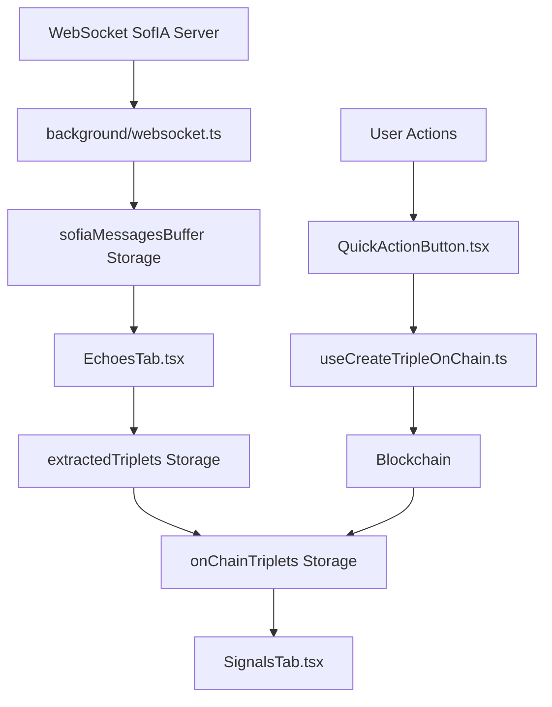

# 🔄 SofIA Data Flow Map

## 📊 Overview
Cette flow map décrit le nouveau système de gestion des données SofIA avec stockage séparé pour optimiser la mémoire et éviter les erreurs de quota.

---

## 🌊 Main Data Flow



---

## 📋 Detailed Flow Steps

### 1. 📨 Message Reception
**File:** `background/websocket.ts`
```
WebSocket Server → messageBroadcast event
├─ Create message with unique ID
├─ Add to sofiaMessagesBuffer (max 10)
├─ Auto-cleanup if buffer full
└─ Error handling for quota exceeded
```

**Storage:** `sofiaMessagesBuffer`
```json
[
  {
    "id": "msg_1234567890_abc123",
    "content": { "text": "..." },
    "created_at": 1234567890,
    "processed": false
  }
]
```

### 2. 🔄 Message Processing 
**File:** `components/pages/graph-tabs/EchoesTab.tsx`
```
processMessageBuffer()
├─ Load sofiaMessagesBuffer
├─ Parse each unprocessed message
├─ Extract triplets using parseSofiaMessage()
├─ Save to extractedTriplets storage
└─ Remove processed messages from buffer
```

**Storage:** `extractedTriplets`
```json
[
  {
    "triplets": [...],
    "rawObjectUrl": "...",
    "rawObjectDescription": "...",
    "sourceMessageId": "msg_1234567890_abc123",
    "extractedAt": 1234567890
  }
]
```

### 3. 📥 Triplet Import
**File:** `components/pages/graph-tabs/EchoesTab.tsx`
```
importTripletFromSofia()
├─ Check if triplet already exists
├─ Create OnChainTriplet object
├─ Set tripleStatus: 'atom-only'
└─ Add to onChainTriplets storage
```

**Storage:** `onChainTriplets`
```json
[
  {
    "id": "triplet_unique_id",
    "triplet": {
      "subject": "User",
      "predicate": "has visited", 
      "object": "Page Title"
    },
    "tripleStatus": "atom-only",
    "source": "created",
    "atomVaultId": "pending"
  }
]
```

### 4. ⛓️ Blockchain Publication
**File:** `hooks/useCreateTripleOnChain.ts`
```
createTripleOnChain()
├─ Create/retrieve User atom
├─ Create/retrieve Predicate atom  
├─ Create Object atom
├─ Create Triple on blockchain
└─ Return VaultIDs + txHash
```

**File:** `hooks/useOnChainTriplets.ts`
```
updateTripletToOnChain()
├─ Update tripleStatus: 'on-chain'
├─ Add blockchain VaultIDs
├─ Add transaction hash
└─ Save to onChainTriplets storage
```

### 5. 📊 Display & Dashboard
**File:** `components/pages/graph-tabs/EchoesTab.tsx`
- Filters: `tripleStatus === 'atom-only'`
- Shows pending triplets for publication

**File:** `components/pages/graph-tabs/SignalsTab.tsx`  
- Filters: `tripleStatus === 'on-chain'`
- Shows published triplets dashboard

---

## 🗂️ Storage Architecture

### Temporary Storage (Auto-cleaned)
```
sofiaMessagesBuffer (max 25 messages)
├─ Raw WebSocket messages
├─ Processing flags
└─ Unique message IDs
```

### Permanent Storage (Managed limits)
```
extractedTriplets (max 100 entries)
├─ Parsed SofIA messages
├─ Extracted triplet data
└─ Source tracking

onChainTriplets (unlimited)
├─ Local triplet management
├─ Blockchain sync status
└─ Publication workflow
```

---

## 🔄 Cleanup & Migration

### Automatic Cleanup
**File:** `background/websocket.ts`
- Buffer limit: 25 messages
- Quota error: Clear buffer completely

**File:** `components/pages/graph-tabs/EchoesTab.tsx`
- Triplets limit: 100 entries
- Sort by extractedAt timestamp

### Manual Cleanup
**File:** `components/pages/graph-tabs/EchoesTab.tsx`
```
clearOldMessages()
├─ Clear sofiaMessagesBuffer
├─ Keep 20 most recent extractedTriplets
├─ Remove legacy sofiaMessages
└─ Reload UI data
```

### Legacy Migration
**File:** `components/pages/graph-tabs/EchoesTab.tsx`
```
migrateLegacyStorage()
├─ Check for old sofiaMessages
├─ Parse and extract triplets
├─ Move to extractedTriplets
└─ Remove legacy storage
```

---

## 🛡️ Error Handling

### Quota Exceeded Errors
1. **WebSocket level:** Clear buffer, continue receiving
2. **Processing level:** Clear buffer, retry processing
3. **Manual level:** User-triggered cleanup with confirmation

### Parse Failures
- Keep message in buffer for retry
- Don't mark as processed
- Log error for debugging

### Blockchain Failures  
- Keep triplet in 'atom-only' status
- Allow retry from UI
- Preserve local data

---

## 📁 File Dependencies

### Core Files
- `background/websocket.ts` - Message reception & buffering
- `components/pages/graph-tabs/EchoesTab.tsx` - Processing & workflow
- `components/pages/graph-tabs/SignalsTab.tsx` - Dashboard display
- `hooks/useOnChainTriplets.ts` - Local storage management
- `hooks/useCreateTripleOnChain.ts` - Blockchain interactions

### Supporting Files
- `components/ui/QuickActionButton.tsx` - User actions
- `components/pages/graph-tabs/types.ts` - Data parsing logic
- `components/styles/AtomCreationModal.css` - UI styling

---

## 🎯 Benefits of New Architecture

✅ **Memory Optimization:** Limited buffer sizes prevent storage bloat
✅ **Data Safety:** Parse before delete ensures no data loss  
✅ **Error Recovery:** Automatic cleanup and retry mechanisms
✅ **User Experience:** Seamless migration from old system
✅ **Scalability:** Separate concerns for better maintainability

---

## 🔍 Monitoring & Debug

### Console Logs to Watch
- `📩 Message SofIA:` - WebSocket reception
- `🔄 Processing X messages from buffer` - Batch processing  
- `✅ Extracted X triplets from message` - Successful parsing
- `🧹 Removed X processed messages from buffer` - Cleanup
- `🚨 Storage quota exceeded` - Error conditions

### Storage Keys to Monitor
- `sofiaMessagesBuffer` - Should stay ≤ 25 items
- `extractedTriplets` - Should stay ≤ 100 items  
- `onChainTriplets` - Grows with user activity
- `sofiaMessages` - Should be removed after migration

### New UI Features
- **Triplet Preview**: Select which triplets to import with checkboxes
- **Selective Import**: Import only chosen triplets instead of all
- **Selective Delete**: Choose which pending triplets to remove
- **Buffer Increased**: 25 messages instead of 10 for better UX

---

**Date** : 2025-07-27  
**Statut** : ✅ Nouveau système opérationnel avec gestion mémoire optimisée