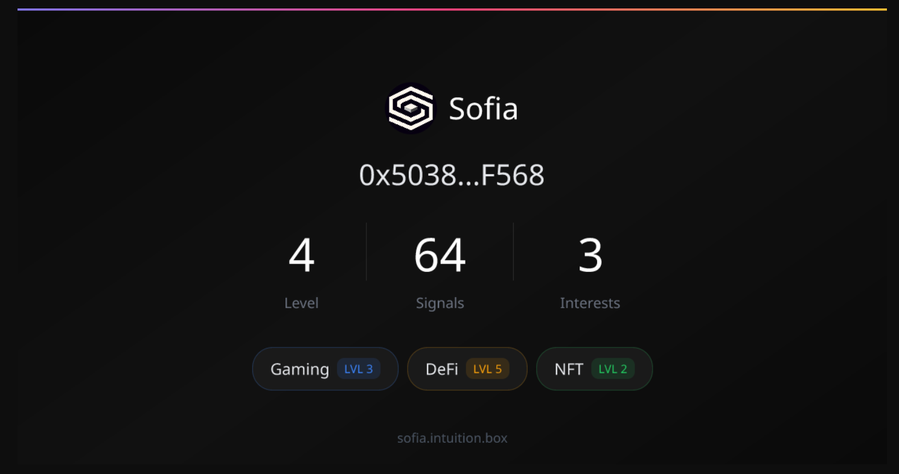

# Sofia OG Image Generator

Dynamic Open Graph image generator for sharing Sofia profiles on X/Twitter.



## Setup

```bash
pnpm install
pnpm dev
```

## Routes

### `GET /api/og` — Generate OG image (1200x630 PNG)

Query params:
| Param | Description | Example |
|---|---|---|
| `wallet` | Wallet address | `0x5038...F568` |
| `level` | User level | `4` |
| `signals` | Number of signals | `64` |
| `interests` | Comma-separated `name:level` | `Gaming:3,DeFi:5,NFT:2` |
| `name` | Display name (optional, defaults to truncated wallet) | `rchris.eth` |

Example:

```
http://localhost:3000/api/og?wallet=0x5038F568&level=4&signals=64&interests=Gaming:3,DeFi:5,NFT:2
```

### `GET /profile` — Landing page with OG meta tags

Same query params as `/api/og`. This page is what gets shared on X — Twitter's bot reads the meta tags and displays the OG image as a card.

## Deploy

Deployed on Coolify as `img-preview-generator` at `https://og.sofia.intuition.box`.
Build via the `Dockerfile` in this folder.

The `OG_BASE_URL` constant defaults to `https://og.sofia.intuition.box` in both
the extension and the explorer, and can be overridden via `VITE_OG_BASE_URL`
(explorer build-time variable in Coolify).

## How it works

1. User clicks "Share on X" in the extension
2. Extension opens Twitter Intent with a link to `/profile?wallet=...&level=...&signals=...&interests=...`
3. Twitter bot visits the URL, reads `og:image` meta tag
4. `og:image` points to `/api/og?...` which generates a PNG via `@vercel/og`
5. Twitter displays the image as a card in the tweet
